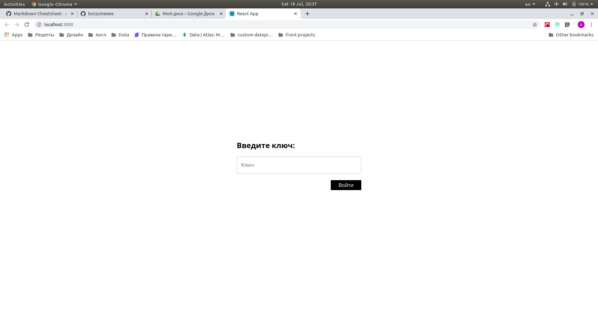
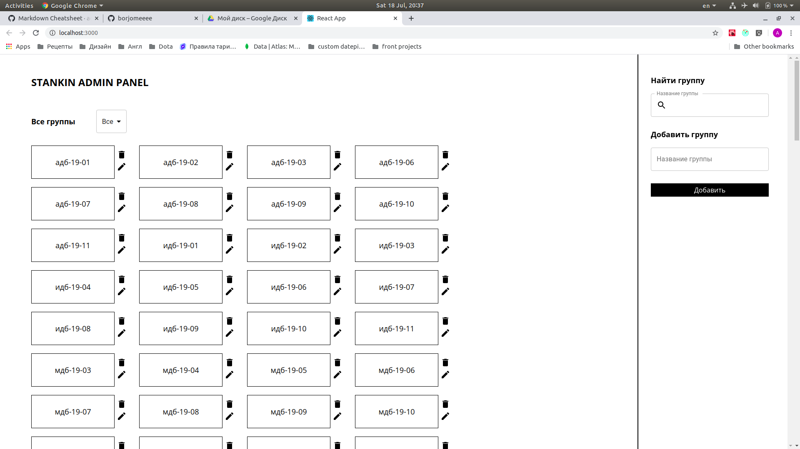
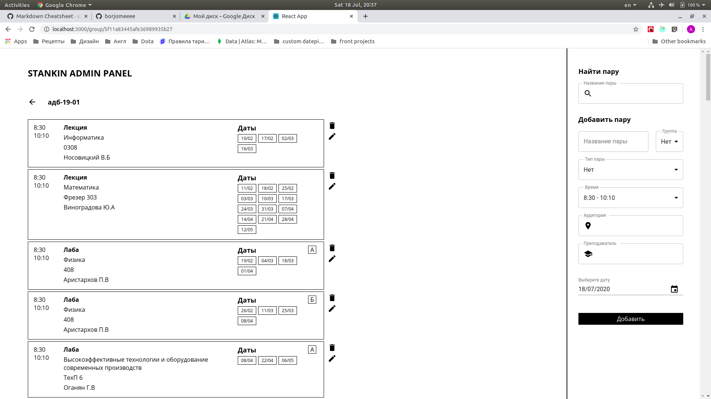
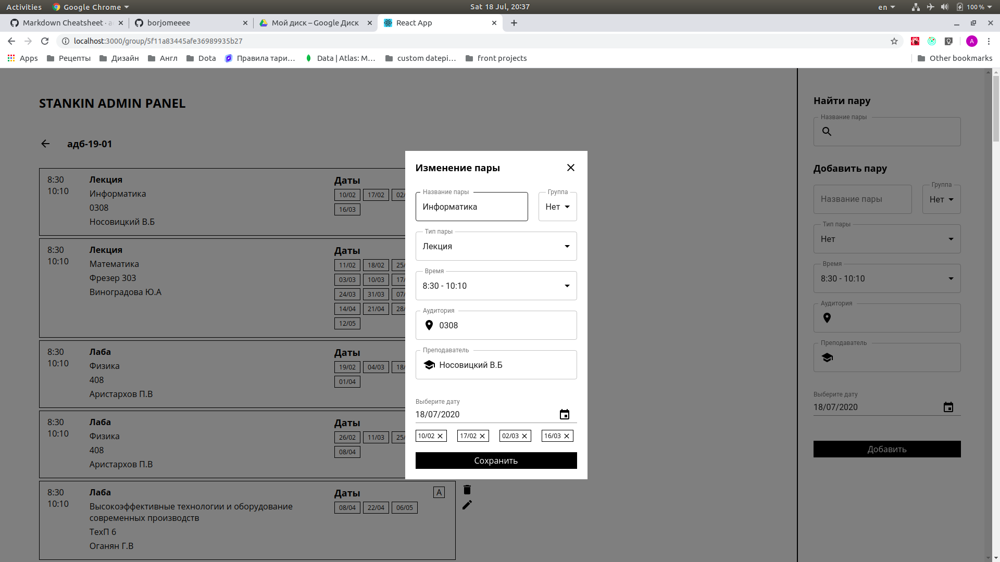

## Stankin admin panel

Данное приложение предназначено для просмотра и изменения данных из моей персональной бд университета со всеми группами и парами для них. 

> Бд ипользуется приложением **Stankin Mobile** для удобного взаимодействия с расписанием любого студента вуза

### Команды для сборки

```javascript
// Установка всех зависимостей
npm install

// Сборка релиз версии (папка build)
npm build
```

Для запуска приложения на локальном сервере используйте команду `npm start`

## Скриншоты

Страница авторизации



Страница со всеми группами



Страница с парами определенной группы



Страница с модальным окном изменения пары

